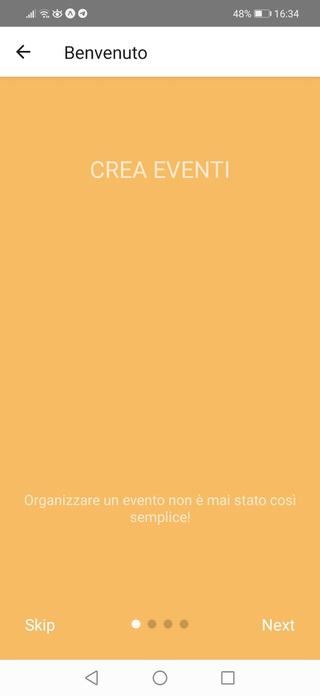
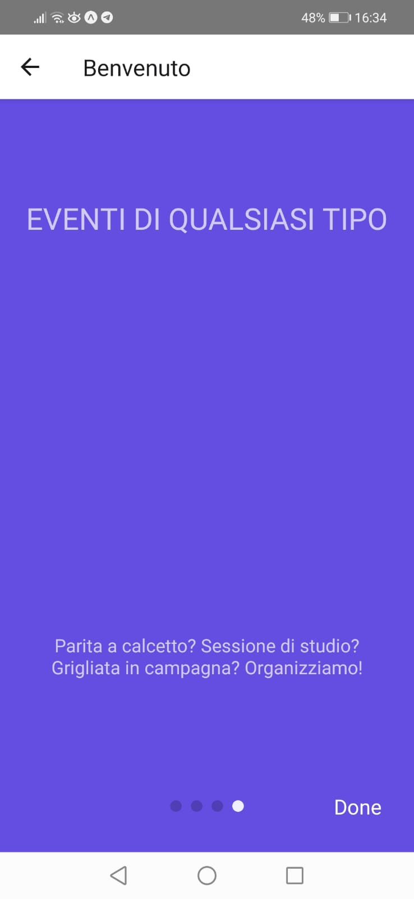
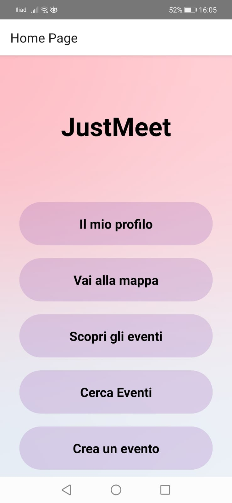

   

---

  
    <b>JustMeet</b>, progetto realizzato in <b>React Native</b> per il corso di <b>Ingegneria del Software</b> presso <b>Unicam</b>, <i>nell'anno accademico 2019/2020</i>, realizzato dagli studenti Stefano Perniola e Loris Palmucci seguendo i canoni di sviluppo proposti
      <b>
</b>

# 📔 Tabella dei contenuti

- [Presentazione del progetto](#panoramica)
- [Tecnologie di base](#tecno)
- [Obiettivi futuri](#obiettivi)
- [Autori](#autore)

# 📝 Presentazione del progetto 

<table style="width:25%">
  <tr>
    
    
    
    
  </tr>
</table>

Si vuole realizzare un sistema software che permetta l’incontro tra persone al fine di svolgere attività cooperative e di squadra. L’obiettivo del sistema è dunque favorire la creazione di gruppi e di nuove amicizie e deve funzionare come una sorta di bacheca avanzata di **annunci pubblici** e di coordinamento.

Gli utenti possono utilizzare la piattaforma per inserire eventi e per richiedere la partecipazione di altri eventi. In particolare la tipologia di evento richiederà di specificare diverse caratteristiche.
Ad esempio il sistema potrebbe permettere di organizzare una partita di calcetto inserendo specifici dati quali: **luogo, orario, titolo, descrizione, topic,nome dell'organizzatore e numero massimo di partecipanti** necessari affinché l’evento abbia luogo. Se le condizioni saranno soddisfatte l'evento pubblico sarà reso non più visibile agli altri.
Parimenti sarà possibile organizzare seminari di studio, feste pubbliche, eventi sportivi di qualsiasi genere e molto altro. 

Una volta effettuato il Login, l'utente sarà  in grado di creare il proprio evento e di visualizzare la lista di tutti gli eventi pubblicati,anche filtrando tali eventi in base alla posizione geografica dell'utente e ottenendo così i più **vicini** a lui. Inoltre l'utente potrà anche **commentare** gli eventi, creando così una rete sociale in cui i vari utenti possono comunicare tra di loro.
Grazie al **topic** che caratterizza un Evento creato, l'utente può essere subito informato sulle attività di suo interesse che si svolgeranno e visualizzarle sulla **mappa**. Potrà altresì mettere la sua partecipazione per informare l'organizzatore della sua presenza.
Nello sviluppo dell’applicazione è stato necessario focalizzarsi e definire la lista degli eventi che la piattaforma supporta.

La **tutela della leggitimità** degli eventi è importante,infatti un **moderatore** sarà incaricato di rimuovere eventi illeggittimi o utenti che non rispettano le buone norme di comportamento.

# 🧰 Tecnologie di base 

Il lato frontend dell’applicativo si rivolge al mondo Mobile ed è stato sviluppato nel linguaggio di programmazione **Javascript** mediante il framework Open Source **React Native**.

L'esperienza di navigazione all'interno dell'applicativo è governata da uno **Stack Navigator**, ovvero una configurazione che permette la navigazione fra i vari componenti in maniera sequenziale, dove ogni nuova schermata è posta in cima allo stack.
Ci si è affidati all'interazione con i servizi attraverso interfacce estese di JpaRepository per quanto riguarda la persistenza dei dati, che sono stati elaborati e gestiti direttamente all'interno del framework di sviluppo backend.

Una seconda implementazione della logica si è basata su un backend scritto in linguaggio **Java**. L'interazione tra frontend e backend è stata resa possibile grazie alla creazione di **API Rest**, la cui scrittura e gestione, sono state rese possibili grazie al framework **Spring Boot**. Per la persistenza dei dati del servizio ci si è affidati al database relazionale **MySQL Workbench**. Per poter rendere più agevole la scrittura del codice tramite l'uso di annotazioni, si è deciso di impiegare la libreria Java **Spring Persistence**.

Per quanto concerne l'utilizzo di alcuni servizi essenziali per gli utenti si è deciso di affidarsi ai servizi API forniti da **Google**, non correlati a quella che è la logica di backend dell'applicativo.

Basandosi su un sistema sicuro e affidabile per quanto riguarda l'autenticazione, si è deciso di impiegare il sistema **Google OAuth 2.0**.

In riferimento alla visualizzazione degli eventi nelle mappe geografiche invece, si è deciso di utilizzare le API **Google Maps**, rese accessibili grazie al modulo react-native-maps integrato nel frontend.

Infine per assicurarsi la legittimità dei luoghi degli eventi ci si è affidati a **Geolocator API**, un servizio speciale in grado di convertire un qualsiasi indirizzo civico in coordinate geografiche. 

# 🎯 Obiettivi futuri 

Si continuerà con lo sviluppo del sistema ampliando le funzionalità e possibilità offerte, integrando le seguenti feature, che per motivi di tempo (progetto universitario) non sono state implementate:
- Implementazione di una nuova feature che permette la possibilità di **stringere amicizia** con altri utenti della piattaforma;
- Implementazione di una nuova feature che permette la possibilità di creare **eventi privati** (visibili solo dagli amici dell'organizzatore dell'evento);
- Implementazione di una nuova feature che permette la possibilità di **ricevere notifiche** in maniera automatica per tutti i partecipanti di un evento una volta che esso abbia raggiunto il numero massimo di partecipanti;
- Implementazione di una nuova feature che permette la possibilità di eseguire la Login o Registrazione con altri **Social Network**;
- Implementazione di una nuova feature che permette la possibilità di inserire **metodi di pagamento** per eventi che prevedono possibili costi.

# 🔭 Autori 

- [Stefano Perniola](https://github.com/xniola)
- [Loris Palmucci](https://github.com/UncleJason88)
